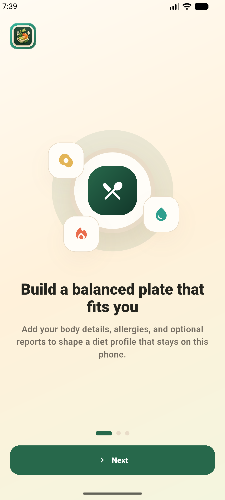
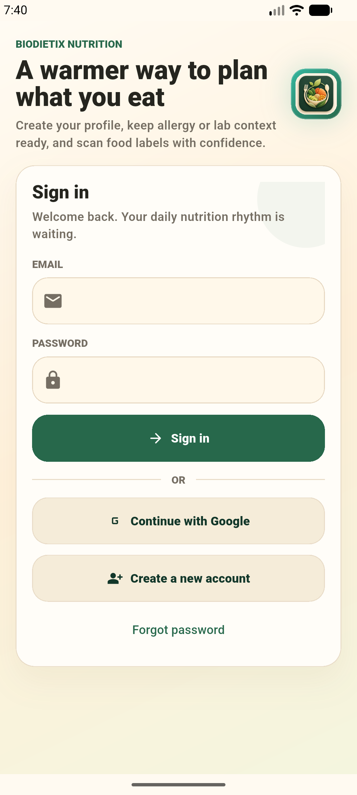
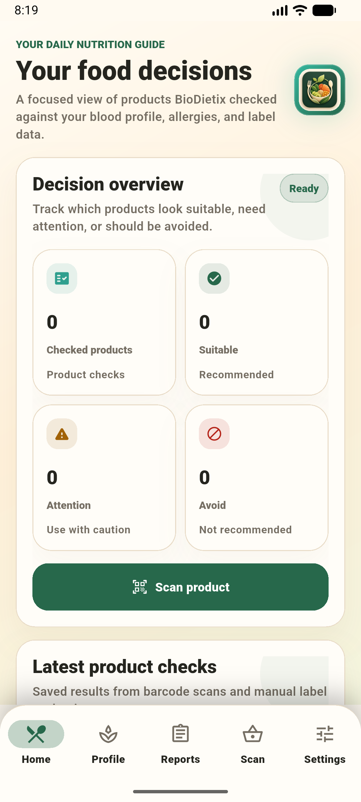
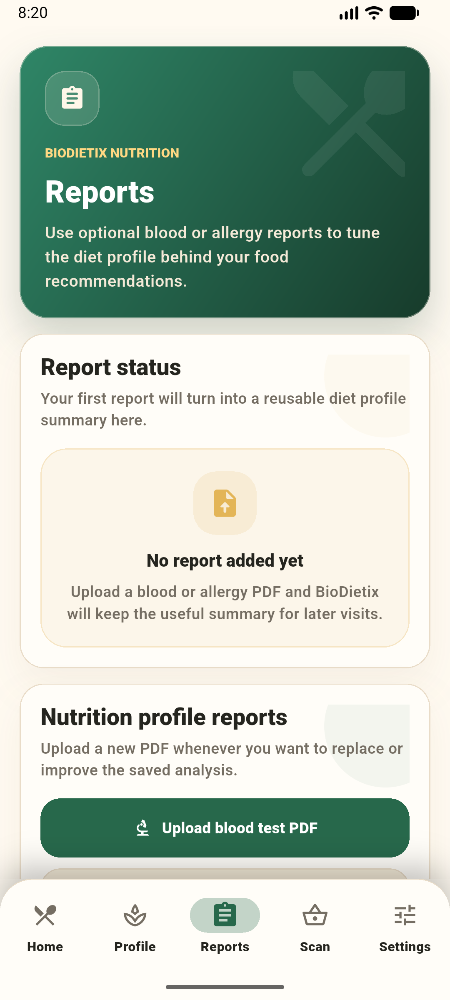
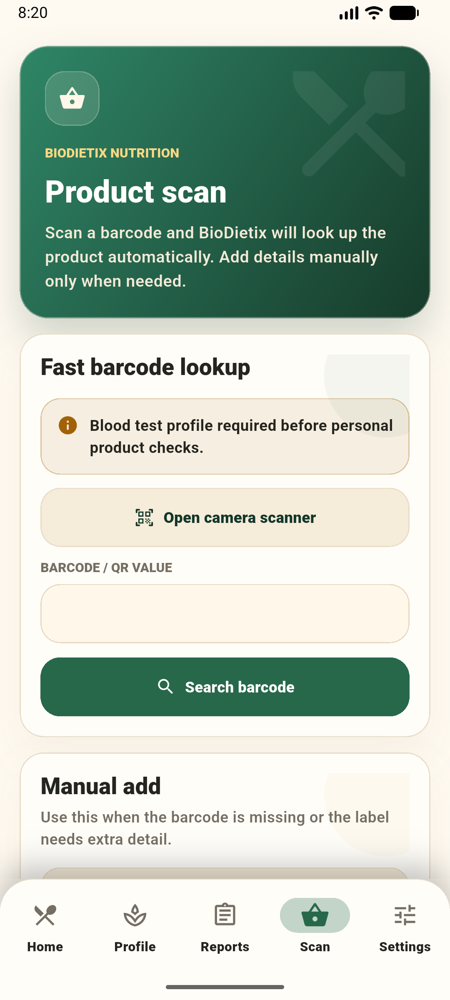
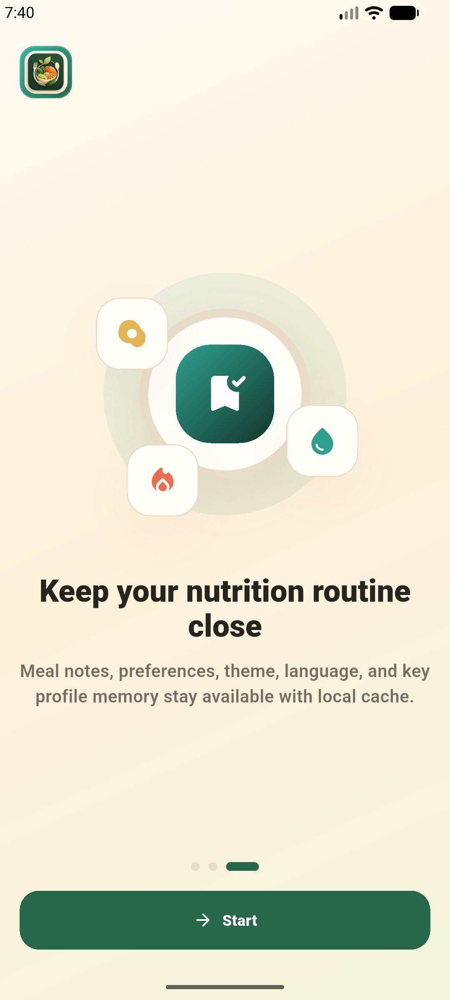
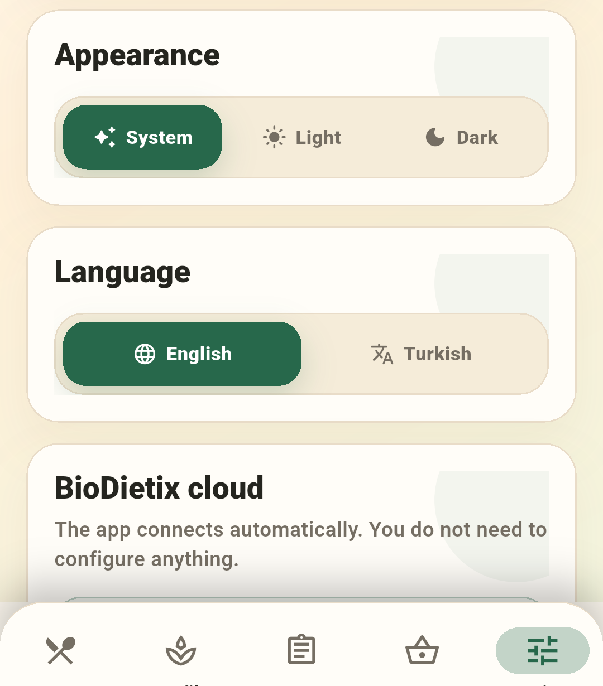
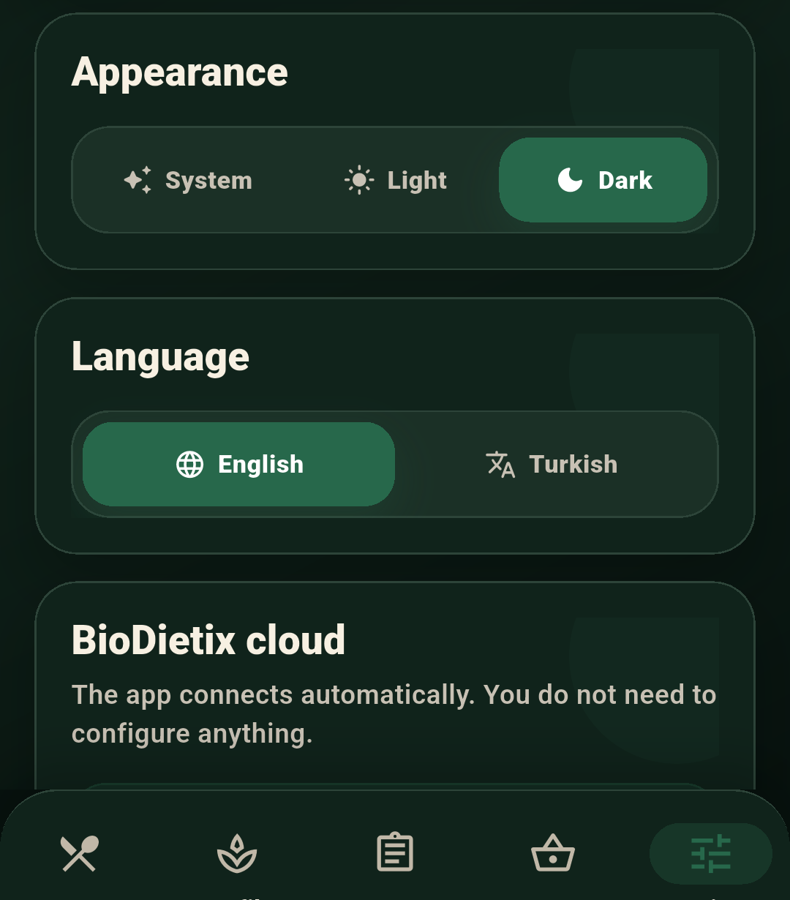
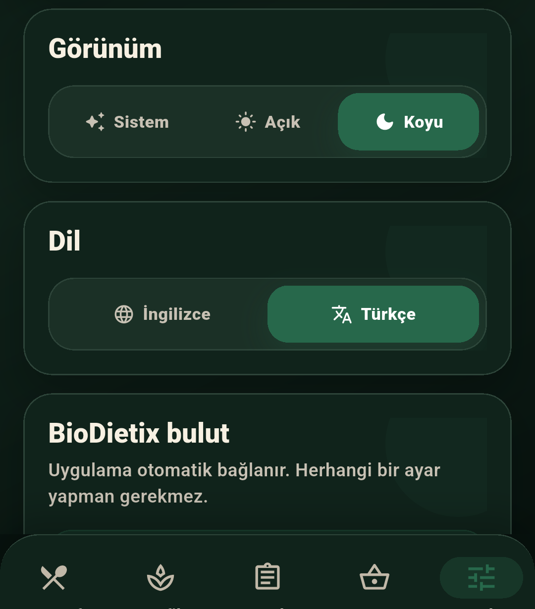
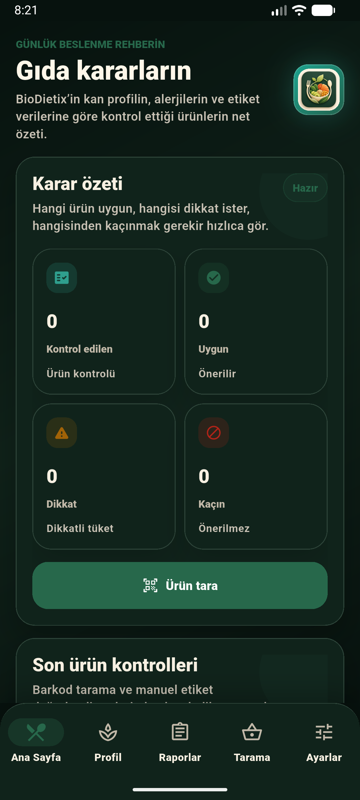

# BioDietix

BioDietix; kan testi, beslenme profili, BMI ve alerji bilgilerini birlikte
değerlendirerek kişiye özel beslenme önerileri ve market ürünü uygunluk
kararları üreten Python + Flutter tabanlı bir öğrenci projesidir.

Proje; Streamlit web arayüzü, FastAPI mobil backend'i ve Firebase Auth kullanan
Flutter Android uygulamasından oluşur. Mobil uygulama kullanıcının son sağlık
profilini telefonda saklar, ürün barkodu/QR değeriyle market ürününü bulur ve
kan testi, BMI, alerji ve besin etiketi sinyallerine göre karar üretir.

Üretim karar yolu kural tabanlıdır. Scikit-learn modelleri yalnızca kural
motorunun pseudo-label çıktısını denetleyen audit deneyleridir; API veya mobil
uygulama tarafından inference modeli olarak kullanılmaz.

> BioDietix tıbbi tanı veya tedavi aracı değildir. Çıktılar eğitim/proje amaçlı
> destekleyici bilgi olarak değerlendirilmelidir.

## İçindekiler

- [Ekran Görüntüleri](#ekran-görüntüleri)
- [Özellikler](#özellikler)
- [Teknoloji Yığını](#teknoloji-yığını)
- [Proje Yapısı](#proje-yapısı)
- [Hızlı Başlangıç](#hızlı-başlangıç)
- [Mobil Uygulama Kurulumu](#mobil-uygulama-kurulumu)
- [API Endpointleri](#api-endpointleri)
- [Kullanım Akışı](#kullanım-akışı)
- [Veri ve Model Notları](#veri-ve-model-notları)
- [Doğrulama](#doğrulama)
- [Mimari ve Operasyon Belgeleri](#mimari-ve-operasyon-belgeleri)

## Ekran Görüntüleri

### İlk Açılış ve Giriş

| Onboarding | Giriş |
| --- | --- |
|  |  |

### Uygulama İçi Ekranlar

| Ana ekran | Raporlar |
| --- | --- |
|  |  |

| Ürün tarama | Ürün kontrol tanıtımı |
| --- | --- |
|  |  |

### Tema ve Dil

| Ayarlar | Koyu tema | Türkçe arayüz |
| --- | --- | --- |
|  |  |  |

| Türkçe + koyu tema |
| --- |
|  |

## Özellikler

- CSV veya PDF kan testi analizinden sağlık profili üretimi.
- Glukoz, HbA1c, lipid, tansiyon, böbrek, karaciğer, vitamin/mineral, yaş ve BMI
  sinyallerine göre risk değerlendirmesi.
- `Health_Profile`, `Nutrition_Recommendation`, `Foods_To_Increase` ve
  `Foods_To_Limit` çıktıları.
- e-Nabız benzeri PDF raporlarından desteklenen laboratuvar alanlarını çıkarma.
- Alerji PDF'i veya manuel alerji bilgisiyle ürün uygunluğu kontrolü.
- Open Food Facts barkod araması ve manuel ürün etiketi girişi.
- Ürün kararları: `recommended`, `use_with_caution`, `not_recommended`.
- Streamlit web arayüzünde CSV/PDF analizi ve ML audit görünümü.
- FastAPI ile mobil uygulamaya analiz ve ürün kontrol servisleri.
- Firebase Email/Password ve Google ile mobil giriş.
- Telefonda profil, alerji, tema, dil ve son test sonucu saklama.
- Türkçe/İngilizce arayüz.
- Sistem/açık/koyu tema seçenekleri.

## Teknoloji Yığını

| Katman | Teknoloji |
| --- | --- |
| Analiz çekirdeği | Python, pandas, scikit-learn |
| Web arayüzü | Streamlit |
| Mobil backend | FastAPI, Uvicorn |
| Mobil uygulama | Flutter, Dart, Material 3 |
| Kimlik doğrulama | Firebase Auth, Google Sign-In |
| Mobil veri saklama | Hive, Firebase servisleri |
| Ürün verisi | Open Food Facts |
| Test | Flutter test, Python unittest |

## Proje Yapısı

```text
.
├── app.py                         # Streamlit web arayüzü
├── api.py                         # Typed ve kimlik doğrulamalı FastAPI backend
├── biodietix.py                   # Ana analiz ve öneri motoru
├── requirements.txt               # Python bağımlılıkları
├── utils/
│   ├── biodietix_web.py           # Web/PDF/CSV yardımcıları
│   ├── biodietix_audit.py         # Veri kalitesi ve ML audit
│   ├── food_recommendation_guide.py
│   └── mobile_health_core.py      # Mobil profil ve ürün kararı çekirdeği
├── data/food_recommendations.csv  # Gıda öneri rehberi
├── mobile/                        # Flutter Android uygulaması
├── docs/                          # Mimari, API, veri, model ve deploy belgeleri
├── tests/                         # Python ürün değerlendirme testleri
├── Dockerfile / render.yaml       # API deploy tanımı
└── firestore.rules / storage.rules
```

## Hızlı Başlangıç

Python ortamını hazırlayın:

```bash
python -m venv .venv
source .venv/bin/activate
pip install -r requirements.txt
```

Streamlit web arayüzünü başlatın:

```bash
streamlit run app.py
```

FastAPI backend'i başlatın:

```bash
BIODIETIX_AUTH_REQUIRED=false \
uvicorn api:app --reload --host 0.0.0.0 --port 8000
```

Kimlik doğrulamayı yalnız yerel geliştirmede kapatın. Üretim değişkenleri
`.env.example` içinde listelenmiştir.

Canlı mobil API varsayılanı:

```text
https://biodietix-ml.onrender.com
```

## Mobil Uygulama Kurulumu

Gereksinimler:

- Flutter 3.44+ ve Dart 3.12+.
- Android SDK.
- Çalışan Android cihaz veya emülatör.
- Firebase projesinde Email/Password ve Google Authentication.
- Firebase App Check: geliştirmede kayıtlı debug token, üretimde Play Integrity.
- Android paket adı: `com.biodietix.biodietix_mobile`.
- Firebase dosyası: `mobile/android/app/google-services.json`.

Firebase Google girişi için Firebase Console'da Android uygulamasına SHA-1 ve
SHA-256 sertifika parmak izleri eklenmelidir. Provider veya sertifika değişirse
`google-services.json` yeniden indirilip `mobile/android/app/` altına
konulmalıdır. Üretim API'si App Check ister; Play Integrity sağlayıcısı Firebase
Console'da etkinleştirilmeden prod build API çağrıları kabul edilmez.

Bağımlılıkları kurun:

```bash
cd mobile
flutter pub get
```

Geliştirme modunda çalıştırın:

```bash
flutter run --flavor dev --dart-define=FLAVOR=dev
```

Yerel backend kullanmak için Android emülatörde `10.0.2.2` adresini kullanın:

```bash
flutter run \
  --flavor dev \
  --dart-define=FLAVOR=dev \
  --dart-define=BIODIETIX_API_URL=http://10.0.2.2:8000
```

Release APK üretin:

```bash
flutter build apk --release --flavor prod --dart-define=FLAVOR=prod
```

App Check zorunluluğu geçici olarak kapalı sideload testinde:

```bash
flutter build apk --release --flavor prod \
  --dart-define=FLAVOR=prod \
  --dart-define=BIODIETIX_API_URL=https://biodietix-ml.onrender.com \
  --dart-define=BIODIETIX_APP_CHECK_ENABLED=false
```

APK çıktısı:

```text
mobile/build/app/outputs/flutter-apk/app-prod-release.apk
```

Bağlı cihaza kurulum:

```bash
adb install -r mobile/build/app/outputs/flutter-apk/app-prod-release.apk
```

Play Store için App Bundle:

```bash
flutter build appbundle --release --flavor prod \
  --dart-define=FLAVOR=prod \
  --dart-define=BIODIETIX_API_URL=https://biodietix-ml.onrender.com \
  --dart-define=BIODIETIX_APP_CHECK_ENABLED=true
```

## API Endpointleri

| Method | Endpoint | Açıklama |
| --- | --- | --- |
| `GET` | `/health` | API sağlık kontrolü |
| `POST` | `/v1/analyze/blood-pdf` | Kan testi PDF analizinden profil üretir |
| `POST` | `/v1/analyze/allergy-pdf` | Alerji PDF metninden alerji sinyalleri çıkarır |
| `GET` | `/v1/product/lookup/{barcode}` | Barkodu Open Food Facts üzerinden arar |
| `POST` | `/v1/product/evaluate` | Ürünü son profil ve alerji bilgisine göre değerlendirir |

`/v1` endpointleri Firebase ID token ister. Ayrıntılar:
[`docs/API.md`](docs/API.md).

## Kullanım Akışı

### Web

1. Streamlit arayüzü açılır.
2. Varsayılan CSV, kullanıcı CSV'i veya PDF raporu seçilir.
3. Gerekirse kilo ve boy girilerek BMI hesaplanır.
4. Analiz çalıştırılır.
5. Sağlık profili, öneriler, artırılacak/sınırlandırılacak besinler ve ML audit
   metrikleri incelenir.
6. Sonuçlar CSV olarak indirilebilir.

### Mobil

1. Kullanıcı Firebase hesabıyla giriş yapar.
2. Profil ekranında yaş, boy, kilo, BMI ve alerji bilgileri tutulur.
3. Kan testi PDF'i yüklendiğinde FastAPI servisi raporu analiz eder.
4. Son sağlık profili telefonda saklanır ve sonraki ürün kontrollerinde kullanılır.
5. Kullanıcı ürün barkodu/QR değeri tarar veya ürün bilgisini manuel girer.
6. BioDietix alerji, BMI, kan testi profili, şeker, doymuş yağ, tuz/sodyum, lif
   ve protein sinyallerine göre ürün kararını gösterir.
7. Ayarlar ekranından dil ve tema anında değiştirilebilir.

## Veri ve Model Notları

Temel CSV alanlarından bazıları:

```text
Gender, Glucose_mgdL, HbA1c_Percent, BMI veya Weight_kg + Height_cm,
Waist_Circumference_cm, BP_Systolic_mmHg, BP_Diastolic_mmHg,
Cholesterol_Total_mgdL, Cholesterol_LDL_mgdL, Triglycerides_mgdL,
Kidney_Creatinine_mgdL, Hemoglobin_gdL, Liver_AST_UL, Daily_Fiber_g,
Daily_Sugar_g, Daily_Fat_g, Daily_Cholesterol_mg
```

Desteklenen ek PDF alanlarından bazıları:

```text
Cholesterol_HDL_mgdL, Liver_ALT_UL, eGFR_ml_min_1_73m2, CRP_mg_L,
Ferritin_ng_mL, Folate_ng_mL, Vitamin_B12_pg_mL, VitaminD_ng_mL,
Iron_ugdL, Calcium_mg_dL, Magnesium_mg_dL, Free_T3_pg_mL, Free_T4_ng_dL
```

`Health_Profile` alanı, kural tabanlı risk motoru tarafından üretilen
denetlenebilir bir pseudo-label olarak kullanılır. ML audit bölümü bu etiket
üzerinden hızlı bir baseline eğitim akışı sunar:

- Ham biyokimyasal ve beslenme özellikleri seçilir.
- Eksik değerler pipeline içinde tamamlanır.
- Nadir profil kombinasyonları `Other Profile` altında gruplanır.
- Random Forest ve Gradient Boosting modelleri eğitilir.
- Survey cycle/yılı mümkünse grup holdout olarak kullanılır.
- Accuracy, balanced accuracy, weighted/macro precision-recall-F1 ve log-loss
  gösterilir.

Sınırlı PDF raporları `Data_Quality_Status=limited` taşır ve genel sağlık için
“Low Risk” iddiası üretmez.
Benzer şekilde, temel analiz sinyallerinin 16'sından azını içeren CSV satırları
`limited` işaretlenir; görülen riskler korunur ancak genel “Low Risk” üretilmez.

## Ürün Kararı Mantığı

`utils/mobile_health_core.py` içindeki ürün değerlendirme akışı şu sinyalleri
birlikte kullanır:

- Alerjen eşleşmeleri.
- Kan şekeri riski ve ürün şekeri.
- Kilo/BMI ve enerji yoğunluğu.
- Tuz/sodyum ve tansiyon riski.
- Doymuş yağ, lif ve protein sinyalleri.
- Ürün veri kalitesi ve eksik etiket bilgisi.

Eksik ürün verisi doğrudan ağır cezalandırılmaz; veri kalitesi düşükse karar ve
gerekçeler kullanıcıya daha temkinli gösterilir.

## Doğrulama

Bu sürümde çalıştırılan kontroller:

```bash
cd mobile
flutter pub get
flutter analyze
flutter test
flutter build apk --debug --flavor dev --dart-define=FLAVOR=dev

cd ..
python -m unittest discover -s tests -v
python -m scripts.validate_dataset BioDietix_CLEAN.csv
ruff check api.py biodietix.py utils tests scripts
```

Release görevi, `mobile/android/key.properties` olmadığında debug anahtarına
düşmek yerine bilinçli olarak duracak şekilde doğrulandı. İmzalı release APK ve
cihaza kurulum, proje sahibinin release keystore'u sağlandıktan sonra release
runbook'unda tamamlanmalıdır.

CI; Python birim/API testleri, Dart format, Flutter analyze/test/debug build ve
bağımlılık audit işlerini çalıştırır.

## Mimari ve Operasyon Belgeleri

- [Mimari](docs/ARCHITECTURE.md)
- [API sözleşmesi](docs/API.md)
- [Karar sistemi/model card](docs/MODEL_CARD.md)
- [Veri yönetişimi](docs/DATA.md)
- [Deploy runbook](docs/DEPLOYMENT.md)
- [Güvenlik politikası](SECURITY.md)
- [Gizlilik ve veri işleme taslağı](PRIVACY.md)

## Lisans ve Uyarı

Bu proje eğitim ve sunum amaçlıdır. Sağlıkla ilgili kararlar için yetkili sağlık
profesyonellerine danışılmalıdır.

Repoda henüz açık kaynak lisansı seçilmemiştir. Lisans seçimi proje sahibinin
hukuki onayını gerektirir.
