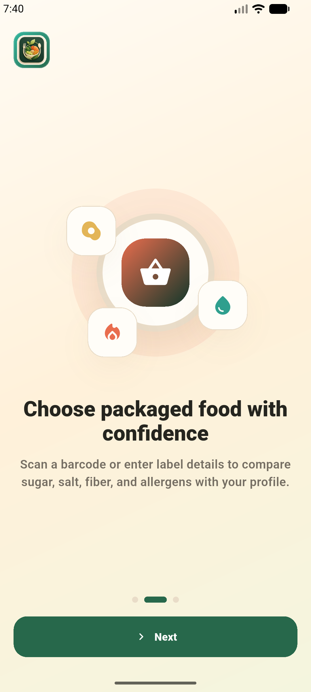

# BioDietix

BioDietix; kan testi, beslenme profili, BMI ve alerji bilgilerini birlikte
değerlendirerek kişiye özel beslenme önerileri ve market ürünü uygunluk
kararları üreten bir öğrenci projesidir. Proje iki ana parçadan oluşur:

- Python/FastAPI/Streamlit tabanlı analiz çekirdeği.
- Firebase Auth kullanan Flutter Android mobil uygulaması.

Uygulama tıbbi tanı veya tedavi amacı taşımaz. Üretilen çıktılar eğitim ve proje
sunumu için destekleyici bilgi olarak değerlendirilmelidir.

## Ekran Görüntüleri

| Başlangıç | Kan testi akışı |
| --- | --- |
|  |  |

| Ürün kontrolü | Giriş ekranı |
| --- | --- |
|  |  |

## Özellikler

- CSV veya PDF kan testi analizinden sağlık profili üretimi.
- Glukoz, HbA1c, lipid, tansiyon, böbrek, karaciğer, vitamin/mineral, yaş ve BMI
  sinyallerine göre risk değerlendirmesi.
- `Health_Profile`, `Nutrition_Recommendation`, `Foods_To_Increase` ve
  `Foods_To_Limit` çıktıları.
- Excel kaynaklı gıda önerilerinin `data/food_recommendations.csv` üzerinden
  sürüm kontrolüne uygun kullanımı.
- Streamlit web arayüzü ile CSV/PDF analizi ve ML audit görünümü.
- FastAPI ile mobil uygulamaya kan testi, alerji testi, barkod arama ve ürün
  değerlendirme endpointleri.
- Flutter Android uygulamasında Firebase Email/Password ve Google giriş.
- Telefonda profil, boy, kilo, BMI, alerji, dil, tema ve son test sonucu
  saklama.
- QR/barkod ürün tarama ve Open Food Facts destekli ürün uygunluk kararı.
- Türkçe/İngilizce arayüz, açık/koyu/sistem tema seçenekleri.

## Proje Yapısı

```text
.
├── app.py                         # Streamlit web arayüzü
├── api.py                         # FastAPI mobil backend
├── biodietix.py                   # Ana analiz ve öneri motoru
├── utils/
│   ├── biodietix_web.py           # Web/PDF/CSV yardımcıları
│   ├── biodietix_audit.py         # Veri kalitesi ve ML audit
│   ├── food_recommendation_guide.py
│   └── mobile_health_core.py      # Mobil profil ve ürün kararı çekirdeği
├── data/food_recommendations.csv  # Gıda öneri rehberi
├── mobile/                        # Flutter Android uygulaması
├── docs/screenshots/              # README ekran görüntüleri
└── tests/                         # Python testleri
```

## Backend Kurulumu

Python 3.10+ önerilir.

```bash
python -m venv .venv
source .venv/bin/activate
pip install -r requirements.txt
```

Streamlit arayüzü:

```bash
streamlit run app.py
```

FastAPI servisi:

```bash
uvicorn api:app --reload --host 0.0.0.0 --port 8000
```

Canlı mobil API varsayılanı:

```text
https://biodietix-ml.onrender.com
```

## Mobil Uygulama Kurulumu

Gereksinimler:

- Flutter 3.44+ ve Dart 3.12+.
- Android SDK ve çalışan bir cihaz/emülatör.
- Firebase projesinde Email/Password ve Google Authentication.
- Android paket adı: `com.biodietix.biodietix_mobile`.
- Firebase dosyası: `mobile/android/app/google-services.json`.

Bağımlılıkları kurun:

```bash
cd mobile
flutter pub get
```

Geliştirme build'i:

```bash
flutter run --flavor dev --dart-define=FLAVOR=dev
```

Release APK:

```bash
flutter build apk --release --flavor prod --dart-define=FLAVOR=prod
```

APK çıktısı:

```text
mobile/build/app/outputs/flutter-apk/app-prod-release.apk
```

Emülatöre veya bağlı Android cihaza kurulum:

```bash
adb install -r mobile/build/app/outputs/flutter-apk/app-prod-release.apk
```

## Mobil API Endpointleri

```text
GET  /health
POST /analyze/blood-pdf
POST /analyze/allergy-pdf
GET  /product/lookup/{barcode}
POST /product/evaluate
```

## Kullanım Akışı

1. Kullanıcı mobil uygulamaya Firebase hesabı ile giriş yapar.
2. Profil ekranında boy, kilo, BMI ve alerji bilgileri kaydedilir.
3. Kan testi PDF'i yüklendiğinde FastAPI servisi raporu analiz eder ve son
   sağlık profili telefonda saklanır.
4. Ürün ekranında barkod/QR taranır veya ürün bilgisi manuel girilir.
5. BioDietix alerji, BMI, kan testi profili, şeker, doymuş yağ, tuz/sodyum, lif
   ve protein sinyallerine göre ürün kararını üretir:
   `recommended`, `use_with_caution` veya `not_recommended`.
6. Ürün uygun değilse daha uygun gıda grubu önerileri gösterilir.

## CSV/PDF Analiz Alanları

Temel CSV alanlarından bazıları:

```text
Gender, Glucose_mgdL, HbA1c_Percent, BMI veya Weight_kg + Height_cm,
Waist_Circumference_cm, BP_Systolic_mmHg, BP_Diastolic_mmHg,
Cholesterol_Total_mgdL, Cholesterol_LDL_mgdL, Triglycerides_mgdL,
Kidney_Creatinine_mgdL, Hemoglobin_gdL, Liver_AST_UL, Daily_Fiber_g,
Daily_Sugar_g, Daily_Fat_g, Daily_Cholesterol_mg
```

Desteklenen ek PDF alanlarından bazıları:

```text
Cholesterol_HDL_mgdL, Liver_ALT_UL, eGFR_ml_min_1_73m2, CRP_mg_L,
Ferritin_ng_mL, Folate_ng_mL, Vitamin_B12_pg_mL, VitaminD_ng_mL,
Iron_ugdL, Calcium_mg_dL, Magnesium_mg_dL, Free_T3_pg_mL, Free_T4_ng_dL
```

## ML Audit Notu

`Health_Profile` alanı, mevcut kural tabanlı risk motoru tarafından üretilen
denetlenebilir bir pseudo-label olarak kullanılır. ML audit bölümü bu etiket
üzerinden okunabilir bir baseline eğitim akışı sunar:

- Ham biyokimyasal ve beslenme özellikleri seçilir.
- Eksik değerler pipeline içinde tamamlanır.
- Nadir profil kombinasyonları `Other Profile` altında gruplanır.
- Random Forest ve Gradient Boosting modelleri eğitilir.
- Accuracy, precision, recall, F1 ve RMSE-style label index metriği gösterilir.

## Doğrulama

Bu sürümde çalıştırılan kontroller:

```bash
cd mobile
flutter pub get
flutter analyze
flutter test
flutter build apk --debug --flavor dev --dart-define=FLAVOR=dev
flutter build apk --release --flavor prod --dart-define=FLAVOR=prod
adb install mobile/build/app/outputs/flutter-apk/app-prod-release.apk
cd ..
python -m unittest discover -s tests -v
```

Not: Yerel Python ortamında `pytest` paketi kurulu olmadığı için
`python -m pytest -q` çalıştırılamadı; Python testleri standart `unittest` ile
doğrulandı.
